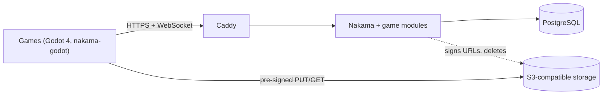

# LinuxGroove game server

One self-hosted online backend for every LinuxGroove game: player accounts,
leaderboards, cloud saves, share codes, ghost and replay uploads, and online
rooms that relay host-authoritative multiplayer. It is
[Nakama](https://heroiclabs.com/nakama/) (Apache-2.0) with PostgreSQL, plus
the modules in this repository that keep every game in its own namespace.

It follows the plans in the game-ideas repository:
[online play](https://github.com/kenvandine/game-ideas/blob/main/online-play.md)
and the [hosting plan](https://github.com/kenvandine/game-ideas/blob/main/infrastructure/nakama-hosting.md).



## For game developers

- [Game API](docs/game-api.md): logging in with a game id, errors, every
  RPC, rooms and the relay protocol, and the Lantern Out module.
- [Adding a game](docs/adding-a-game.md): register a new game and its server
  logic.

Run a local server with the test game turned on:

```sh
(cd modules && npm ci && npm run build)
docker compose -f deploy/compose/compose.yaml up -d --wait
node scripts/smoke-test.mjs        # 35 end-to-end checks
```

The server is then at `http://127.0.0.1:7350` with server key `defaultkey`,
and the admin console at `http://127.0.0.1:7351` (user `operator`, password
`localdev-password`).

## For server admins

The production server is a strictly confined snap for Ubuntu with Nakama,
PostgreSQL 16 and Caddy inside:

```sh
sudo snap install linuxgroove-game-server
sudo snap set linuxgroove-game-server server-key=<key> domain=api.example.org
sudo linuxgroove-game-server.info
```

[Operations](docs/operations.md) covers settings, secrets, HTTPS, backups and
restore, splitting the database onto its own machine, updates and monitoring.

## Repository layout

| Path | What |
| --- | --- |
| `modules/` | Nakama runtime modules in TypeScript, built to one `index.js` |
| `modules/src/core/` | Shared services: login checks, namespacing guards, leaderboards, storage, share codes, blobs, rooms and the relay match |
| `modules/src/games/` | One file per game: its definition and any game-specific RPCs |
| `modules/test/` | Unit tests (Node's test runner, no server needed) |
| `config/nakama.yml` | Base Nakama settings shared by the snap and Compose |
| `snap/` | Snap packaging: `snapcraft.yaml`, hooks and service scripts |
| `deploy/compose/` | Docker Compose for development, CI and non-Ubuntu hosts |
| `scripts/smoke-test.mjs` | End-to-end test against a running server |

## Design notes

- **One server, many games.** A session is bound to one game by the `game`
  session var at login. Leaderboards, storage collections, blob keys, rooms,
  matchmaker tickets and game RPCs are all namespaced by game id, and hooks
  refuse anything outside the session's game.
- **Offline first.** Games work without the server; online features are
  extras the server advertises through `core.config`.
- **Host-authoritative rooms.** Online rooms reuse each game's LAN mode: one
  player's device hosts and the server relays. Godot games use nakama-godot's
  multiplayer bridge in rooms named `<game>:<CODE>`, so LAN and online share
  the same code; games that need the server to run the room use relay rooms.
  Dedicated headless Godot match servers can come later for games that need
  them, without changing the API.
- **Scales by steps.** Everything on one machine first; then the database on
  its own machine (`role=database` and `role=api`), or a managed PostgreSQL;
  big files always go to object storage, never through Nakama.
- **Secrets stay out of snap settings**, which every local user can read.
  Session keys, database passwords and the object storage key live in a
  root-only directory in the snap's data. (The server key isn't a secret: it
  ships inside every game build.)

## License

Copyright (c) 2026 The LinuxGroove team. Licensed under Apache-2.0 (see
[LICENSE](LICENSE) and [NOTICE](NOTICE)). Nakama is Apache-2.0, PostgreSQL is
under the PostgreSQL License, and Caddy is Apache-2.0.
